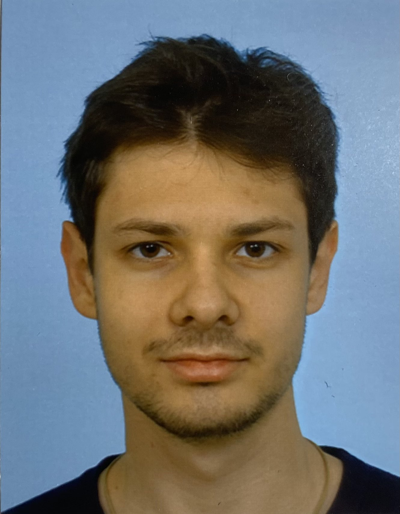

## About Me

Hi there. I am a second year freshman at Faculty of Electric Engineering of the University Ljubljana. 

In this jekyll based resume you will get to know some facts about me. 

## Research Interest

I specialize myself into researching the effects of seismic movements on radioactive radiation in the vicinity of Nuclear powerplant Krško in Slovenia. If I recall, when I was a child, I was always fascinated by large earthquakes that seemed so powerful and unstoppable. On the other hand radioacive radiation brought my attention in highschool. 

## Publications

[J.Biles Earthquakes](https://www.academia.edu/4320448/Earthquakes_Literature)

## Typography

Year | Award | Category
-----|-------|--------
2020 | Abel Prize| Won Outstanding Computer Science Award 
2021 | Fields Medal| Nominated for Best Young Scientist in Slovenia
2021 | Turing Prize | Won Best Scientist Award 

---

**The following quote conceptualises the meaning of waking up** 

> The  most dangerous distractions are the ones you love, but that don't love you back                                                                     ~Warren Buffet

## References

* Foo Bar: Head of Department, Placeholder Names, Lorem
* John Doe: Associate Professor, Department of Computer Science, Ipsum
